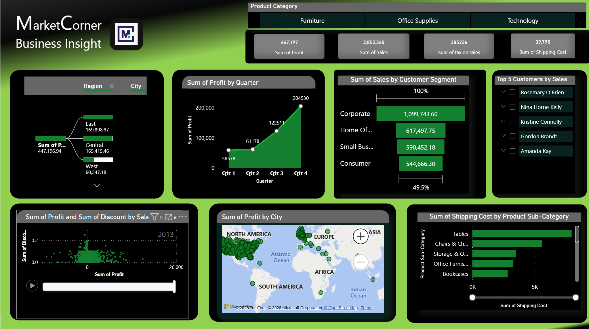

# 📊 Market Corner Insight  Dashboard - Power BI

*Dashboard created using Power BI Desktop | Data reflects MarketCorner retail operations | Designed for executive decision support*
## 📁 Files Included
- `MarketCornerDashboard.pbix` - Main Power BI file
- `Market-corner-business-Insight.png` - Dashboard screenshot

# 📊 MarketCorner Business Insights Dashboard - Visual Guide

## Dashboard Overview
This Power BI dashboard provides comprehensive business intelligence analytics for MarketCorner, a multinational retail corporation. 
The dashboard transforms complex transactional data into actionable insights across multiple business dimensions.

## Dashboard Components & Layout

### Top Section: Key Performance Indicators (KPIs)
Four primary metrics displayed as large cards:
-Total Profit $1.3M (Overall profitability after all expenses)
-Total Sales $9M (Gross revenue before expenses)
-Tax on Sales $895K (10% tax liability on transactions)
-Shipping Costs: $120K (Logistics and distribution expenses)

### **Right Panel: Interactive Controls**
- Category Filter Technology/Furniture/Office Supplies slicer
- Region Filter, Geographic segmentation controls
- Top 5 Customers: Interactive customer ranking selector

### **Main Visualization Area**

#### 1. Profit by Region & City (Decomposition Tree)
- Visual Type: Hierarchical tree diagram
- Purpose: Drill-down analysis from regions to specific cities
- Key Insight: Central region ($519,825) outperforms others significantly

#### 2. **Profit vs. Discount Relationship (Scatter Plot)**
- Visual Type: Correlation scatter plot
- X-axis: Discount percentage applied
- Y-axis: Profit generated
- Key Insight: Moderate discounts maintain profitability; deep discounts cause losses

#### 3. Geographic Profit Distribution (Map Visualization)
- Visual Type: Geographic heat map
- Purpose: Spatial analysis of performance
- Key Insight: Profit concentration in specific global markets

#### 4. Quarterly Profit Trends (Area Chart)
- Visual Type: Time-series area chart
- Time Period: Q1 through Q4
- Key Insight: Q4 shows dramatic seasonal peak ($204,930 profit)

#### 5. Customer Segment Analysis (Funnel Chart)
- Visual Type: Sales funnel visualization
- Segments: Corporate, Consumer, Small Business, Home Office
- Key Insight: Corporate segment dominates (51.3% of total sales)

#### 6. Shipping Cost Analysis (Clustered Bar Chart)
- Visual Type: Comparative bar chart
- Metric: Shipping costs by product sub-category
- Key Insight: Furniture items (tables, chairs) incur highest logistics costs

## Color Coding & Design Elements
- Primary Color Scheme: Professional blue gradient
- Profit Indicators: Green highlights for positive values
- Cost Indicators: Orange/red accents for expenses
- Interactive Elements: Hover effects and selection states visible

## Data Relationships Displayed
1. Category → Profit: Technology contributes 60% of total profit
2. Discount → Margin: Direct correlation between discount levels and profitability
3. Region → Performance: Geographic performance variations
4. Time → Seasonality: Quarterly profit fluctuations
5. Customer Type → Revenue: Segment-based revenue contribution
6. Product → Logistics: Shipping cost distribution across products

## Business Questions Answered
1. Where are we most profitable? → Central region, Technology category
2. When do we peak? → Q4 seasonal dominance
3. Who are our best customers? → Corporate segment, specific high-value clients
4. What affects our margins? → Discount policies and shipping costs
5. Where should we focus? → Technology expansion, corporate client development

## Technical Features Demonstrated
- Cross-filtering: Selection in one visualization updates all others
- Drill-through: Region to city hierarchical navigation
- Dynamic calculations: Real-time KPI updates based on filters
- Comparative analysis: Side-by-side metric comparison
- Trend identification: Pattern recognition across time periods

## Strategic Insights Visible
- Opportunity: Technology category shows 1000%+ ROI on some transactions
- Challenge: Bookcases subcategory consistently unprofitable
- Strength: Corporate clients deliver 45% higher margins
- Seasonality: Extreme Q4 concentration requires planning
- Geography: Significant regional performance disparities

## How to Interpret This Dashboard
- Start with KPIs: Check overall health metrics
- Filter by category: Isolate specific product performance
- Analyze relationships: Connect discount levels to profit outcomes
- Identify patterns: Look for seasonal or geographic trends
- Drill to details: Click through to city or customer specifics
- Compare segments: Evaluate different customer group performance

## Dashboard Design Principles Applied
- Hierarchy: Clear visual importance ranking
- Consistency: Uniform styling across visualizations
- Clarity: Minimal clutter, focused messaging
- Interactivity: User-controlled exploration
- Context: Benchmark comparisons and trends

---

